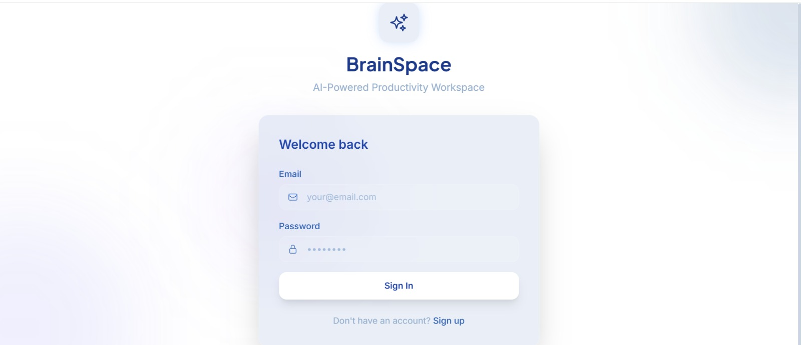
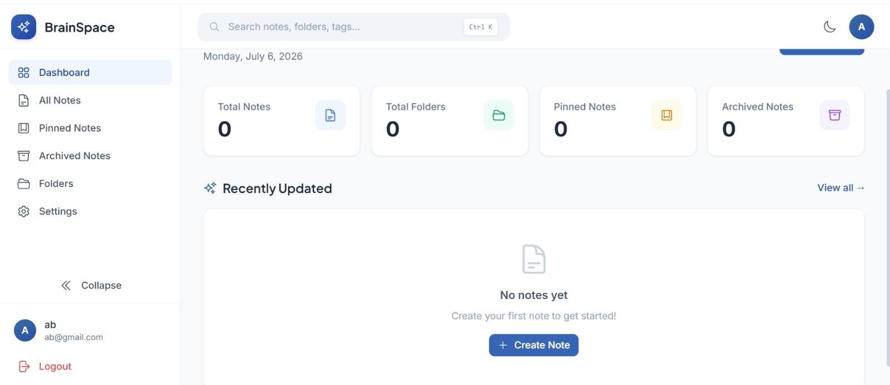
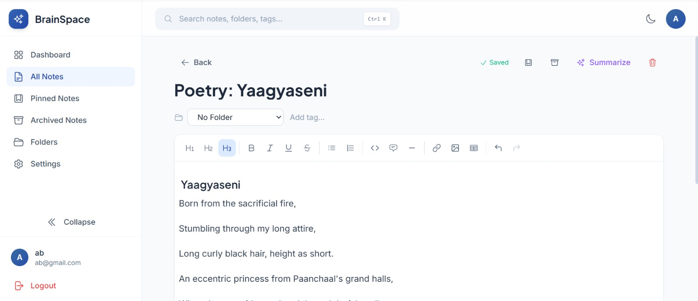
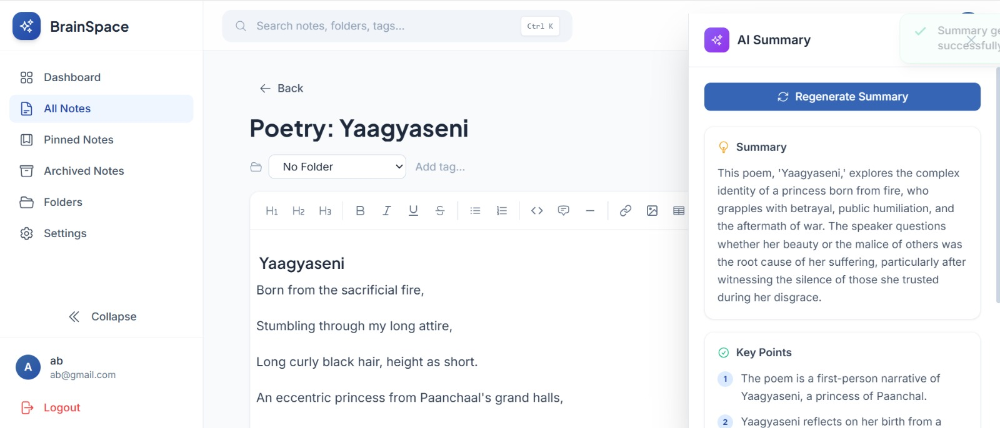
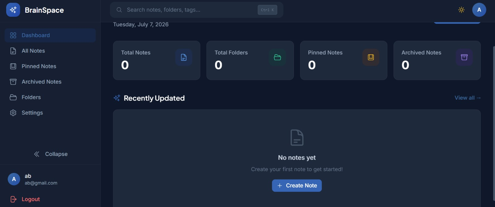
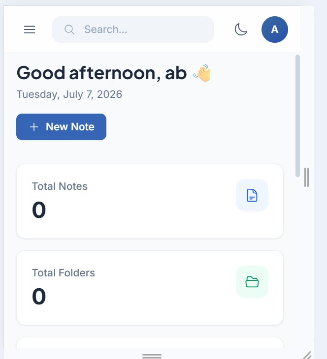

# 🧠 BrainSpace – AI Productivity Workspace

A production-quality full-stack MERN application for students and professionals. Manage notes with a rich text editor, organize them into folders, and get AI-powered summaries using Google's Gemini API.

  

## ✨ Features

- **JWT Authentication** — Signup, login, persistent sessions, protected routes
- **Rich Text Editor** — TipTap-based editor with headings, bold/italic/underline, lists, code blocks, tables, links, images
- **Note Management** — Full CRUD with pin, archive, restore, duplicate
- **Folder Organization** — Create, rename, delete folders with color coding
- **AI Summarization** — One-click note summaries powered by Google Gemini API
- **Real-Time Search** — Instant search across titles, content, and tags
- **Dark Mode** — System-aware with manual toggle, persisted preference
- **Autosave** — Notes auto-save every 3 seconds
- **Responsive Design** — Works on desktop, tablet, and mobile
- **Loading Skeletons** — Smooth loading states throughout
- **Toast Notifications** — Success/error feedback on all actions

## 🛠 Tech Stack

| Layer     | Technology                                                      |
|-----------|------------------------------------------------------------------|
| Frontend  | React 19, Vite, Tailwind CSS, React Router DOM, TipTap, Axios  |
| Backend   | Node.js, Express.js, MongoDB Atlas, Mongoose, JWT, bcrypt       |
| AI        | Google Gemini API (gemini-1.5-flash)                            |


## 📁 Project Structure

```
brainspace/
├── backend/
│   ├── config/db.js           # MongoDB connection
│   ├── controllers/           # Auth, Folder, Note, AI controllers
│   ├── middleware/auth.js     # JWT verification middleware
│   ├── models/                # User, Folder, Note schemas
│   ├── routes/                # Express routers
│   ├── utils/generateToken.js # JWT signing utility
│   ├── server.js              # Express entry point
│   ├── package.json
│   └── .env.example
├── frontend/
│   ├── src/
│   │   ├── components/        # Sidebar, TopNav, NoteCard, NoteEditor, AISidePanel, etc.
│   │   ├── context/           # AuthContext, ThemeContext, ToastContext
│   │   ├── layouts/           # AppLayout (sidebar + topnav shell)
│   │   ├── pages/             # Dashboard, AllNotes, NotePage, Folders, Settings, etc.
│   │   ├── services/api.js    # Axios instance with JWT interceptors
│   │   ├── App.jsx            # Routing setup
│   │   ├── main.jsx           # Entry point
│   │   └── index.css          # Global styles + Tailwind
│   ├── tailwind.config.js
│   ├── postcss.config.js
│   ├── package.json
│   └── .env.example
└── README.md
```

## 🚀 Quick Start

### Prerequisites

- Node.js >= 18
- MongoDB Atlas account (free tier works)
- Google Gemini API key (optional, for AI features)

### 1. Clone & Install

```bash
# Clone the repo
cd brainspace

# Install backend
cd backend
npm install

# Install frontend
cd ../frontend
npm install
```

### 2. Configure Environment

**Backend** – Create `backend/.env`:
```env
PORT=5000
NODE_ENV=development
MONGO_URI=mongodb+srv://<user>:<pass>@cluster0.xxxxx.mongodb.net/brainspace?retryWrites=true&w=majority
JWT_SECRET=your_super_secret_key_here
JWT_EXPIRES_IN=7d
GEMINI_API_KEY=your_gemini_api_key
CLIENT_URL=http://localhost:5173
```

**Frontend** – Create `frontend/.env`:
```env
VITE_API_URL=http://localhost:5000/api
```

### 3. Run Development Servers

```bash
# Terminal 1 – Backend
cd backend
npm run dev

# Terminal 2 – Frontend
cd frontend
npm run dev
```

Frontend: http://localhost:5173  
Backend: http://localhost:5000  
Health check: http://localhost:5000/health

## 📡 API Routes

| Method | Route                     | Description           | Auth |
|--------|---------------------------|-----------------------|------|
| POST   | `/api/auth/signup`        | Register new user     | ❌   |
| POST   | `/api/auth/login`         | Login & get token     | ❌   |
| GET    | `/api/auth/profile`       | Get current user      | ✅   |
| PUT    | `/api/auth/profile`       | Update user profile   | ✅   |
| GET    | `/api/folders`            | List all folders      | ✅   |
| POST   | `/api/folders`            | Create folder         | ✅   |
| PUT    | `/api/folders/:id`        | Rename folder         | ✅   |
| DELETE | `/api/folders/:id`        | Delete folder         | ✅   |
| GET    | `/api/notes`              | List notes (filtered) | ✅   |
| GET    | `/api/notes/stats`        | Dashboard stats       | ✅   |
| GET    | `/api/notes/:id`          | Get single note       | ✅   |
| POST   | `/api/notes`              | Create note           | ✅   |
| PUT    | `/api/notes/:id`          | Update note           | ✅   |
| DELETE | `/api/notes/:id`          | Delete note           | ✅   |
| POST   | `/api/notes/:id/archive`  | Toggle archive        | ✅   |
| POST   | `/api/notes/:id/pin`      | Toggle pin            | ✅   |
| POST   | `/api/notes/:id/duplicate`| Duplicate note        | ✅   |
| POST   | `/api/ai/summarize`       | AI summarize note     | ✅   |
## Screenshots

### Login Page



### Dashboard



### Rich Text Editor



### AI Summary



### DarkMode



### Mobile View




## 📝 License

MIT License — feel free to use this project for learning, personal projects, or as a starter template.

---

**Built with using the MERN Stack + Gemini AI**
